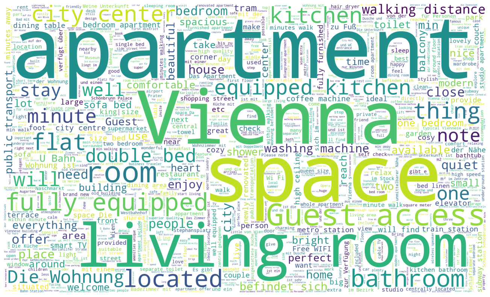

## Airbnb Price Modelling
#### Business analytics of Vienna's Airbnb listings and price modelling using geospatial OpenStreetMap features

### 1. Introduction
This project aims at predicting Airbnb host charging prices of a potential new listing across Vienna.
There is public information available about roughly 12,000 Airbnb listings and their hosts.

A machine learning pipline has been established, where OSM features are used for price modelling. These features include
the location of amenities such as shops, bars, restaurants, tourist destinations etc.

The project includes a web app that displays some business analytics as well as an interface for price predicting
a benchmark price of potential new listing, based on the geolocation.
new message and get classified results. The visualization is implemented as a 
plotly Dash app which is on deploy on Aszure and accessible [here](https://airbnb-price-prediction.azurewebsites.net/).  

### 2. File Structure

`app.py` main dash app  
`requirements.txt` python modules that will be installed for the web application at build  
`runtime.txt` tells (the Gunicorn HTTP server) which Python version to use (only needed for Heroku deployment) 
`Procfile` defines what type of process is going to run (Gunicorn web process) and the Python app entrypoint
(only needed for Heroku deployment)  
`/assets` this directory is to serve the CSS files and images. Generating the figures is done in `charts.py`  
`/data` this folder contains the raw input `csv files`, the `database file` as well as the `process_data.py`  
`/data/neighbourhoods.geojson` geojson file with the geospatial data of [Viennas neighbourhoods](http://insideairbnb.com/get-the-data.html)
`/data/vienna/listings_det.csv` csv file with data of [listings](http://insideairbnb.com/get-the-data.html)
nerate the model (`train_classifier.py`) as well as the model as a `Pickle file`  
`/nb/airbnb_vienna.ipynb` jupyter notebooks used for data exploration, feature extraction etc. and the analysis outcome  
`.gitignore` 

### 3. Installation

#### Getting Started

- Change the current directory to the location where you want to clone the repository and run:

`$ git clone https://github.com/AReburg/Airbnb-Price-Prediction.git`
- Make sure that the app is running on the local webserver before deployment.
Setup your virtualenv (or don't) and ensure you have all the modules installed before running the app. 

#### Requirements
Install the modules from the `requirements.txt` with pip3 or conda from a terminal in the project root folder:

`pip install -r requirements.txt`  
`conda install --file requirements.txt` (Anaconda)
 

#### Jupyter Notebook
Executing the notebook is tested on *anaconda distribution 6.4.12.*  with 
*python 3.9.13*. Since the notebook is *>100 mb* without the cleared outputs it is converted to html and
can be viewed [here](https://github.com/AReburg/Airbnb-Price-Prediction/nb/Airbnb-Analysis.html).

### 4. Usage

#### Local Web Application
- Run the app from your IDE direct, or from the terminal in the projects root directory: `python app.py`

- It should be visible on the browser via `http://127.0.0.1:8050/`

- Open the app in the browser and start playing around

### 5. Results
The main findings will be published in a Medium post. Feel free to contact me if you have any questions or suggestions.
To view the rendered geospatial charts of the Jupyter notebook go to [nbviewer](https://nbviewer.org/) and copy the 
notebooks link.

#### Model Evaluation

### Conclusion
So there you have it. Now you know how many restaurants there are within a 10-minute walk of each Airbnb property 80,000 AirBnb properties. You could repeat this process for bars, shops, subway stations, tourist hotspots, public parks, and whatever else you think may influence the price of an Airbnb property — as I did.
In my final XGBoost model, as you can see below, these OSM features (highlighted in red) ended up being some of the most important drivers of price in London.

#### Copyright and Licencing
This project is licensed under the terms of the MIT license

#### Authors, Acknowledgements

